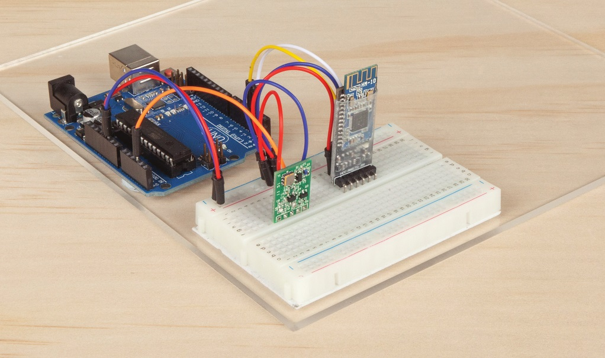

# Bluetooth Power Point

Control a collection of powerpoints with your phone app

Here's a great project that lets you use your Smartphone (using Bluetooth) to turn on/off any appliance such as a TV, computer, table lamp, etc. directly from the power point without getting up off the couch or out of bed.

While it might seem simple, this project opens up the world of bluetooth possibilities for your future arduino projects.

## Bill of materials

| Qty | Code                                     | Description                   |
| --- | ---------------------------------------- | ----------------------------- |
| 1   | [XC4410](https://jaycar.com.au/p/XC4410) | Arduino UNO compatible device |
| 1   | [WC6028](https://jaycar.com.au/p/WC6028) | plug socket leads             |
| 1   | [XC4382](https://jaycar.com.au/p/XC4382) | Bluetooth module              |
| 1   | [ZW3100](https://jaycar.com.au/p/ZW3100) | 433Mhz Transmitter            |
| 1   | [MS6149](https://jaycar.com.au/p/MS6149) | Spare RF mains switch         |

## Instructions

Check out https://www.jaycar.com.au/bluetooth-powerpoint for wiring diagrams and instructions

This repo maintains code for the project. Contributions and improvements are encouraged